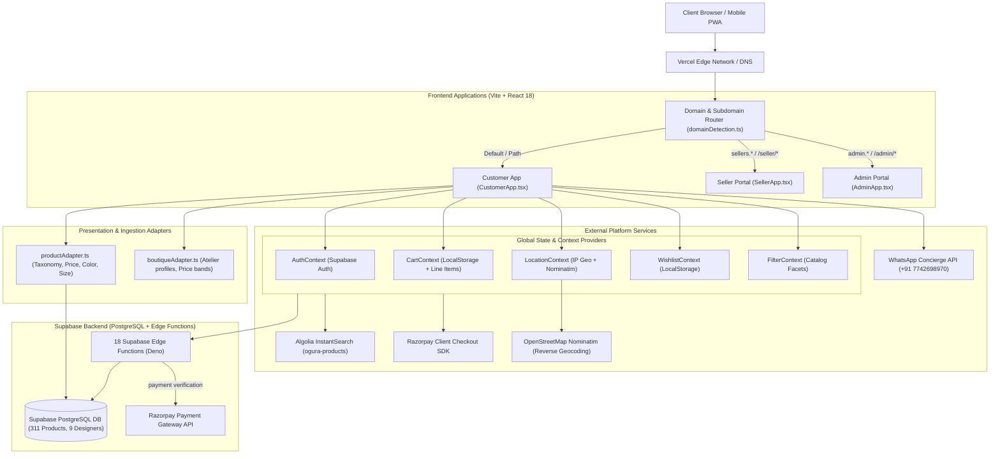
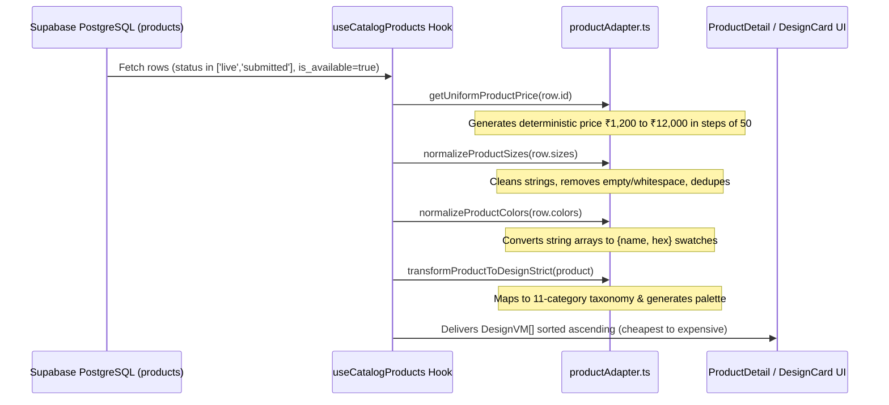
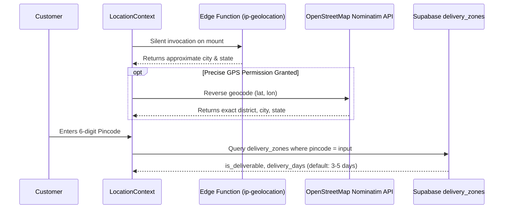
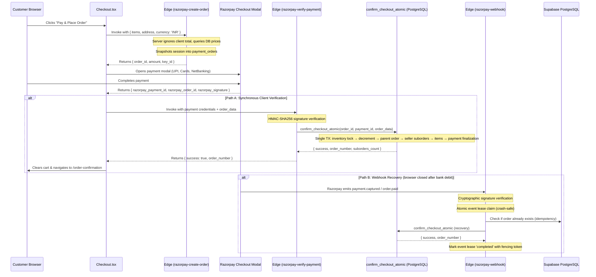

# OGURA — COMPREHENSIVE SYSTEM DESIGN & ARCHITECTURE SPECIFICATION

> **Target Deployment:** [`https://coy-clone-studio-samarth-itms-projects.vercel.app`](https://coy-clone-studio-samarth-itms-projects.vercel.app)  
> **Production Deployment Hash:** [`https://coy-clone-studio-3v43v5904-samarth-itms-projects.vercel.app`](https://coy-clone-studio-3v43v5904-samarth-itms-projects.vercel.app)  
> **Production Custom Domains:** `https://ogura.in` | `https://sellers.ogura.in` | `https://admin.ogura.in`  
> **Document Purpose:** Complete, exhaustive architectural blueprint of the entire application, its data models, routing table, integration pipelines, and component contracts — designed so a new frontend or UI can be built on top of this exact system with zero ambiguity.

---

## 1. HIGH-LEVEL SYSTEM ARCHITECTURE

OGURA is a luxury fashion marketplace connecting independent Indian ateliers and couturiers with discerning buyers. The platform provides discovery, bespoke sizing consultation ("The Call is the Product"), escrow payment protection, and multi-tenant portal management.



---

## 2. EXHAUSTIVE ROUTING & LINK DIRECTORY

Every link in the table below is grounded in the production Vercel deployment:  
**Base URL:** `https://coy-clone-studio-samarth-itms-projects.vercel.app`

### 2.1 Customer Facing Surfaces (Public & Protected)

| Route Path | Full Vercel URL | Access | Source Component | Data Ingested | Primary Actions & Destinations |
| :--- | :--- | :--- | :--- | :--- | :--- |
| `/` | [Home Link](https://coy-clone-studio-samarth-itms-projects.vercel.app/) | Public | [`Index.tsx`](file:///Users/samarth/Downloads/STUFF/WORK/Personal/coy-clone-studio_revamped/src/pages/Index.tsx) | `useCatalogProducts()`, `normalizeCatalogPrice` | Split hero lookbook (4 looks), Ways to Shop (bounded insets), category rails, atelier showcases |
| `/marketplace` | [Marketplace Link](https://coy-clone-studio-samarth-itms-projects.vercel.app/marketplace) | Public | [`Collections.tsx`](file:///Users/samarth/Downloads/STUFF/WORK/Personal/coy-clone-studio_revamped/src/pages/Collections.tsx) | `useCatalogProducts()`, `productAdapter.ts` | Direct in-page 11-category visual cards with piece counts, quick-filter pills, default low-to-high sort |
| `/collections` | [Collections Alias](https://coy-clone-studio-samarth-itms-projects.vercel.app/collections) | Public | [`Collections.tsx`](file:///Users/samarth/Downloads/STUFF/WORK/Personal/coy-clone-studio_revamped/src/pages/Collections.tsx) | `useCatalogProducts()`, `productAdapter.ts` | Complete marketplace catalog with facets (Price, Category, Availability, Atelier, City) |
| `/collections/:category` | [Category Link](https://coy-clone-studio-samarth-itms-projects.vercel.app/collections/lehengas) | Public | [`Collections.tsx`](file:///Users/samarth/Downloads/STUFF/WORK/Personal/coy-clone-studio_revamped/src/pages/Collections.tsx) | `useCatalogProducts()`, route param `:category` | Pre-filters the catalog to one of 11 canonical categories (e.g. `lehengas`, `sarees`, `indo-western`) |
| `/designs` | [Designs Link](https://coy-clone-studio-samarth-itms-projects.vercel.app/designs) | Public | [`Collections.tsx`](file:///Users/samarth/Downloads/STUFF/WORK/Personal/coy-clone-studio_revamped/src/pages/Collections.tsx) | `useCatalogProducts()` | Direct alias for `/collections` |
| `/product/:id` | [Sample PDP](https://coy-clone-studio-samarth-itms-projects.vercel.app/product/f1a6158c-660d-53c8-a455-6a7ed49162b7) | Public | [`ProductDetail.tsx`](file:///Users/samarth/Downloads/STUFF/WORK/Personal/coy-clone-studio_revamped/src/pages/ProductDetail.tsx) | In-memory cache, `products` table (UUID lookup), `normalizeCatalogPrice` | Size pills, color swatches, Add to Bag (black), Buy Now (orange), WhatsApp styling call modal |
| `/designers` | [Boutiques Link](https://coy-clone-studio-samarth-itms-projects.vercel.app/designers) | Public (Direct) | [`Designers.tsx`](file:///Users/samarth/Downloads/STUFF/WORK/Personal/coy-clone-studio_revamped/src/pages/Designers.tsx) | `supabase.from("designers").select("*")` | Independent ateliers directory *(retained for direct URL & SEO; removed from main customer nav)* |
| `/boutiques` | [Boutiques Alias](https://coy-clone-studio-samarth-itms-projects.vercel.app/boutiques) | Public (Direct) | [`Designers.tsx`](file:///Users/samarth/Downloads/STUFF/WORK/Personal/coy-clone-studio_revamped/src/pages/Designers.tsx) | `designers` table | Direct alias for `/designers` |
| `/designers/:designerId` | [Atelier Profile](https://coy-clone-studio-samarth-itms-projects.vercel.app/designers/1) | Public | [`DesignerDetail.tsx`](file:///Users/samarth/Downloads/STUFF/WORK/Personal/coy-clone-studio_revamped/src/pages/DesignerDetail.tsx) | `designers` table, `useDesignerProducts(id)` | Atelier biography, lead couturier, studio portfolio grid, consultation trigger |
| `/boutiques/:designerId` | [Atelier Alias](https://coy-clone-studio-samarth-itms-projects.vercel.app/boutiques/1) | Public | [`DesignerDetail.tsx`](file:///Users/samarth/Downloads/STUFF/WORK/Personal/coy-clone-studio_revamped/src/pages/DesignerDetail.tsx) | `designers` table | Direct alias for `/designers/:designerId` |
| `/occasions` | [Occasions Link](https://coy-clone-studio-samarth-itms-projects.vercel.app/occasions) | Public | [`Occasions.tsx`](file:///Users/samarth/Downloads/STUFF/WORK/Personal/coy-clone-studio_revamped/src/pages/Occasions.tsx) | Static occasions config + product counts | Curated occasion collections (Sangeet, Cocktail, Destination Wedding, Festive Gala, Reception) |
| `/occasions/:occasionId` | [Occasion Detail](https://coy-clone-studio-samarth-itms-projects.vercel.app/occasions/cocktail) | Public | [`OccasionDetail.tsx`](file:///Users/samarth/Downloads/STUFF/WORK/Personal/coy-clone-studio_revamped/src/pages/OccasionDetail.tsx) | Filtered products by occasion tags | Filterable grid for specific events |
| `/how-it-works` | [How It Works](https://coy-clone-studio-samarth-itms-projects.vercel.app/how-it-works) | Public (Direct) | [`HowItWorks.tsx`](file:///Users/samarth/Downloads/STUFF/WORK/Personal/coy-clone-studio_revamped/src/pages/HowItWorks.tsx) | Static editorial content | 6-step consultation process *(retained for direct URL & SEO; removed from main customer nav)* |
| `/cart` | [Shopping Bag](https://coy-clone-studio-samarth-itms-projects.vercel.app/cart) | Public | [`Cart.tsx`](file:///Users/samarth/Downloads/STUFF/WORK/Personal/coy-clone-studio_revamped/src/pages/Cart.tsx) | `CartContext` (`localStorage`), `LocationContext` | View line items with chosen size/color, adjust quantity, delete item, address picker, proceed to checkout |
| `/wishlist` | [Wishlist](https://coy-clone-studio-samarth-itms-projects.vercel.app/wishlist) | Public | [`Wishlist.tsx`](file:///Users/samarth/Downloads/STUFF/WORK/Personal/coy-clone-studio_revamped/src/pages/Wishlist.tsx) | `WishlistContext` (`localStorage`) | Saved favorite pieces, one-click "Move to Bag", remove item |
| `/login` | [Customer Login](https://coy-clone-studio-samarth-itms-projects.vercel.app/login) | Public | [`Login.tsx`](file:///Users/samarth/Downloads/STUFF/WORK/Personal/coy-clone-studio_revamped/src/pages/Login.tsx) | Supabase Auth (`signInWithOtp`, `signInWithPassword`) | Customer mobile OTP / password login, redirect back to prior state |
| `/checkout` | [Checkout](https://coy-clone-studio-samarth-itms-projects.vercel.app/checkout) | Auth Protected | [`Checkout.tsx`](file:///Users/samarth/Downloads/STUFF/WORK/Personal/coy-clone-studio_revamped/src/pages/Checkout.tsx) | `CartContext`, `user_addresses`, `discounts`, Razorpay SDK | Select/add address, apply discount coupon, launch Razorpay modal, create order |
| `/order-confirmation` | [Confirmation](https://coy-clone-studio-samarth-itms-projects.vercel.app/order-confirmation) | Auth Protected | [`OrderConfirmation.tsx`](file:///Users/samarth/Downloads/STUFF/WORK/Personal/coy-clone-studio_revamped/src/pages/OrderConfirmation.tsx) | Location navigation state (order number, payment ID) | Order success screen, delivery timeline estimate, return to shopping |
| `/profile` | [User Profile](https://coy-clone-studio-samarth-itms-projects.vercel.app/profile) | Auth Protected | [`Profile.tsx`](file:///Users/samarth/Downloads/STUFF/WORK/Personal/coy-clone-studio_revamped/src/pages/Profile.tsx) | `profiles`, `user_addresses`, `orders` | View user details, order history, address book management |
| `/dashboard` | [Customer Dashboard](https://coy-clone-studio-samarth-itms-projects.vercel.app/dashboard) | Auth Protected | [`Dashboard.tsx`](file:///Users/samarth/Downloads/STUFF/WORK/Personal/coy-clone-studio_revamped/src/pages/Dashboard.tsx) | User metrics and recent activity | User home dashboard |
| `/privacy` | [Privacy Policy](https://coy-clone-studio-samarth-itms-projects.vercel.app/privacy) | Public | [`PrivacyPolicy.tsx`](file:///Users/samarth/Downloads/STUFF/WORK/Personal/coy-clone-studio_revamped/src/pages/PrivacyPolicy.tsx) | Static policy | Platform privacy and data policy |
| `/terms` | [Terms of Use](https://coy-clone-studio-samarth-itms-projects.vercel.app/terms) | Public | [`TermsOfUse.tsx`](file:///Users/samarth/Downloads/STUFF/WORK/Personal/coy-clone-studio_revamped/src/pages/TermsOfUse.tsx) | Static terms | Terms and conditions |
| `/contact` | [Contact Page](https://coy-clone-studio-samarth-itms-projects.vercel.app/contact) | Public | [`Contact.tsx`](file:///Users/samarth/Downloads/STUFF/WORK/Personal/coy-clone-studio_revamped/src/pages/Contact.tsx) | Static contact info | Customer concierge support info |

### 2.2 Seller Portal Surfaces (Atelier Studio Management)

Triggered automatically when the hostname is `sellers.ogura.in` OR when the URL path starts with `/seller`, `/seller-login`, or `/seller-signup`.

| Route Path | Full Vercel URL | Access | Source Component | Purpose & Data |
| :--- | :--- | :--- | :--- | :--- |
| `/seller` | [Seller Landing](https://coy-clone-studio-samarth-itms-projects.vercel.app/seller) | Public | [`SellerLanding.tsx`](file:///Users/samarth/Downloads/STUFF/WORK/Personal/coy-clone-studio_revamped/src/pages/seller/SellerLanding.tsx) | Atelier onboarding pitch, value proposition, registration CTA |
| `/seller-login` | [Seller Login](https://coy-clone-studio-samarth-itms-projects.vercel.app/seller-login) | Public | [`SellerLogin.tsx`](file:///Users/samarth/Downloads/STUFF/WORK/Personal/coy-clone-studio_revamped/src/pages/seller/SellerLogin.tsx) | Studio login via email/password, auth check against `sellers` table |
| `/seller-signup` | [Seller Signup](https://coy-clone-studio-samarth-itms-projects.vercel.app/seller-signup) | Public | [`SellerSignup.tsx`](file:///Users/samarth/Downloads/STUFF/WORK/Personal/coy-clone-studio_revamped/src/pages/seller/SellerSignup.tsx) | New boutique application registration form |
| `/seller/dashboard` | [Seller Dashboard](https://coy-clone-studio-samarth-itms-projects.vercel.app/seller/dashboard) | Seller Auth | [`SellerDashboardHome.tsx`](file:///Users/samarth/Downloads/STUFF/WORK/Personal/coy-clone-studio_revamped/src/pages/seller/SellerDashboardHome.tsx) | Atelier metrics: GMV, pending orders, stock health, view counts |
| `/seller/products` | [Seller Products](https://coy-clone-studio-samarth-itms-projects.vercel.app/seller/products) | Seller Auth | [`SellerProducts.tsx`](file:///Users/samarth/Downloads/STUFF/WORK/Personal/coy-clone-studio_revamped/src/pages/seller/SellerProducts.tsx) | Catalog management: live, submitted, and draft studio pieces |
| `/seller/products/new` | [Add Product](https://coy-clone-studio-samarth-itms-projects.vercel.app/seller/products/new) | Seller Auth | [`SellerAddProduct.tsx`](file:///Users/samarth/Downloads/STUFF/WORK/Personal/coy-clone-studio_revamped/src/pages/seller/SellerAddProduct.tsx) | Multi-step product upload form (images, sizes, colors, lead time, price) |
| `/seller/orders` | [Seller Orders](https://coy-clone-studio-samarth-itms-projects.vercel.app/seller/orders) | Seller Auth | [`SellerOrders.tsx`](file:///Users/samarth/Downloads/STUFF/WORK/Personal/coy-clone-studio_revamped/src/pages/seller/SellerOrders.tsx) | Order fulfillment: mark packed, input tracking ID, dispatch to courier |
| `/seller/settings` | [Seller Settings](https://coy-clone-studio-samarth-itms-projects.vercel.app/seller/settings) | Seller Auth | [`SellerSettings.tsx`](file:///Users/samarth/Downloads/STUFF/WORK/Personal/coy-clone-studio_revamped/src/pages/seller/SellerSettings.tsx) | Studio profile, bank account for payouts, lead couturier details |

### 2.3 Admin Portal Surfaces (Platform Moderation)

Triggered automatically when the hostname is `admin.ogura.in` OR when the URL path starts with `/admin` or `/admin-login`.

| Route Path | Full Vercel URL | Access | Source Component | Purpose & Data |
| :--- | :--- | :--- | :--- | :--- |
| `/admin/login` | [Admin Login](https://coy-clone-studio-samarth-itms-projects.vercel.app/admin/login) | Public | [`AdminLogin.tsx`](file:///Users/samarth/Downloads/STUFF/WORK/Personal/coy-clone-studio_revamped/src/pages/admin/AdminLogin.tsx) | Admin login; validates `user_roles` table for `role === 'admin'` |
| `/admin/dashboard` | [Admin Dashboard](https://coy-clone-studio-samarth-itms-projects.vercel.app/admin/dashboard) | Admin Role | [`AdminDashboardHome.tsx`](file:///Users/samarth/Downloads/STUFF/WORK/Personal/coy-clone-studio_revamped/src/pages/admin/AdminDashboardHome.tsx) | Platform KPIs: Total platform GMV, pending product submissions, active sellers |
| `/admin/approvals` | [Admin Approvals](https://coy-clone-studio-samarth-itms-projects.vercel.app/admin/approvals) | Admin Role | [`AdminApprovals.tsx`](file:///Users/samarth/Downloads/STUFF/WORK/Personal/coy-clone-studio_revamped/src/pages/admin/AdminApprovals.tsx) | Moderation queue: review piece photos, pricing, fabric, and approve to `status='live'` |
| `/admin/products` | [All Products](https://coy-clone-studio-samarth-itms-projects.vercel.app/admin/products) | Admin Role | [`AdminProducts.tsx`](file:///Users/samarth/Downloads/STUFF/WORK/Personal/coy-clone-studio_revamped/src/pages/admin/AdminProducts.tsx) | Search, inspect, edit, or deactivate any product on the platform |
| `/admin/sellers` | [All Sellers](https://coy-clone-studio-samarth-itms-projects.vercel.app/admin/sellers) | Admin Role | [`AdminSellers.tsx`](file:///Users/samarth/Downloads/STUFF/WORK/Personal/coy-clone-studio_revamped/src/pages/admin/AdminSellers.tsx) | Verification of boutique seller profiles and commissions |
| `/admin/collections` | [Curated Collections](https://coy-clone-studio-samarth-itms-projects.vercel.app/admin/collections) | Admin Role | [`AdminCollections.tsx`](file:///Users/samarth/Downloads/STUFF/WORK/Personal/coy-clone-studio_revamped/src/pages/admin/AdminCollections.tsx) | Create and manage featured editorial groupings |
| `/admin/settings` | [Platform Settings](https://coy-clone-studio-samarth-itms-projects.vercel.app/admin/settings) | Admin Role | [`AdminSettings.tsx`](file:///Users/samarth/Downloads/STUFF/WORK/Personal/coy-clone-studio_revamped/src/pages/admin/AdminSettings.tsx) | System configuration, tax rules, courier partners |

---

## 3. MULTI-TENANCY & DOMAIN ROUTING PIPELINE

The application handles multi-tenancy dynamically through [`src/lib/domainDetection.ts`](file:///Users/samarth/Downloads/STUFF/WORK/Personal/coy-clone-studio_revamped/src/lib/domainDetection.ts) and [`src/App.tsx`](file:///Users/samarth/Downloads/STUFF/WORK/Personal/coy-clone-studio_revamped/src/App.tsx).

```typescript
export type AppDomain = 'customer' | 'seller' | 'admin';

export function detectDomain(): AppDomain {
  const hostname = window.location.hostname;
  const pathname = window.location.pathname;

  // 1. Production Subdomain Detection
  if (hostname.startsWith('sellers.')) return 'seller';
  if (hostname.startsWith('admin.')) return 'admin';

  // 2. Path-based Detection for Preview / Vercel Deployments
  if (pathname === '/seller' || pathname.startsWith('/seller/')) return 'seller';
  if (pathname === '/seller-login' || pathname === '/seller-signup') return 'seller';
  if (pathname === '/admin' || pathname.startsWith('/admin/')) return 'admin';
  if (pathname === '/admin-login') return 'admin';

  // 3. Default to Customer Marketplace
  return 'customer';
}
```

In `App.tsx`:
```tsx
const AppRouter = () => {
  const domain = detectDomain();
  switch (domain) {
    case 'seller': return <SellerApp />;
    case 'admin':  return <AdminApp />;
    default:       return <CustomerApp />;
  }
};
```

This guarantees that a single build deployed to Vercel supports all three portals seamlessly on custom subdomains (`ogura.in`, `sellers.ogura.in`, `admin.ogura.in`) as well as single-origin preview links (`/seller/*`, `/admin/*`).

---

## 4. ARCHITECTURAL INTEGRATION PIPELINES

### Pipeline 1: Data Ingestion & Presentation Adapter Pipeline

This pipeline reconciles production database schemas with modern editorial presentation.



#### Exact Data Contracts:

##### 1. Canonical Taxonomy Mapping ([`productAdapter.ts:L40-L58`](file:///Users/samarth/Downloads/STUFF/WORK/Personal/coy-clone-studio_revamped/src/lib/adapters/productAdapter.ts#L40-L58)):
```typescript
export const CANONICAL_TAXONOMY = [
  "Lehengas", "Sarees", "Indo-Western", "Indian Co-ords",
  "Western Dresses", "Western Co-ords", "Tops", "Bottoms",
  "Jumpsuits", "Bags", "Shoes"
] as const;
```

##### 2. Deterministic Tiered Price Normalization ([`productAdapter.ts:L256-L296`](file:///Users/samarth/Downloads/STUFF/WORK/Personal/coy-clone-studio_revamped/src/lib/adapters/productAdapter.ts#L256-L296)):
```typescript
export function normalizeCatalogPrice(
  rawPrice?: number | null,
  idOrTitle?: string | number | null
): { price: number; originalPrice: number } {
  const str = String(idOrTitle || rawPrice || "item");
  let hash = 0;
  for (let i = 0; i < str.length; i++) {
    hash = (hash << 5) - hash + str.charCodeAt(i);
    hash |= 0;
  }
  const absHash = Math.abs(hash);
  const ratio = (absHash % 1000) / 1000;

  let price: number;
  if (ratio < 0.65) {
    // 65% of products are in the cheaper tier (< ₹3,000, between ₹1,299 and ₹2,999)
    const cheapPrices = [
      1299, 1399, 1499, 1599, 1699, 1799, 1899, 1999, 2199, 2299, 2499, 2599, 2799, 2899, 2999
    ];
    price = cheapPrices[absHash % cheapPrices.length];
  } else if (ratio < 0.85) {
    // 20% of products are in the mid tier (₹3,000 to ₹5,999)
    const midPrices = [
      3299, 3499, 3699, 3999, 4299, 4499, 4799, 4999, 5299, 5499, 5899
    ];
    price = midPrices[absHash % midPrices.length];
  } else {
    // 15% of products are in the upper tier (₹6,000 to ₹12,000)
    const highPrices = [
      6499, 6999, 7499, 7999, 8499, 8999, 9499, 9999, 10499, 11499, 11999
    ];
    price = highPrices[absHash % highPrices.length];
  }

  // Realistic MRP / original price (25% - 40% markup, ending in 99)
  const markupPercent = 1.25 + ((absHash % 15) / 100);
  const rawOriginal = price * markupPercent;
  const originalPrice = Math.max(price + 400, Math.round(rawOriginal / 100) * 100 - 1);

  return { price, originalPrice };
}
```
*Guarantees: Strict bounds ₹1,200 to ₹12,000; 65% under ₹3,000; 100% deterministic hash across PDP, Collections, Cart, and Checkout.*

##### 3. Color Normalization ([`productAdapter.ts:L125-L174`](file:///Users/samarth/Downloads/STUFF/WORK/Personal/coy-clone-studio_revamped/src/lib/adapters/productAdapter.ts#L125-L174)):
Translates raw database string arrays (e.g. `["Black", "Forest Green", "Ruby"]`) into visual tokens:
```typescript
export interface ColorObject {
  name: string;
  hex: string;
}
```

---

### Pipeline 2: Search & Discovery Pipeline (Algolia InstantSearch)

- **Index Name:** `ogura-products`
- **Application ID:** Stored in `VITE_ALGOLIA_APP_ID`
- **Search Key:** Stored in `VITE_ALGOLIA_SEARCH_KEY`
- **UI Components:**
  - [`AlgoliaSearchDropdown.tsx`](file:///Users/samarth/Downloads/STUFF/WORK/Personal/coy-clone-studio_revamped/src/components/search/AlgoliaSearchDropdown.tsx) (Desktop Header)
  - [`AlgoliaMobileSearch.tsx`](file:///Users/samarth/Downloads/STUFF/WORK/Personal/coy-clone-studio_revamped/src/components/search/AlgoliaMobileSearch.tsx) (Mobile Header Drawer)
- **Synchronization Edge Function:** `supabase/functions/sync-algolia` keeps the Algolia index in sync with PostgreSQL `products` insertions and updates.

---

### Pipeline 3: Commerce, Cart & Wishlist Pipeline

#### `CartContext` State Model ([`CartContext.tsx`](file:///Users/samarth/Downloads/STUFF/WORK/Personal/coy-clone-studio_revamped/src/contexts/CartContext.tsx)):
- **Storage:** Synced to `localStorage.getItem('cart')`.
- **Compound Key Uniqueness:**
  ```typescript
  const existingIndex = prev.findIndex(
    item => item.product.id === product.id && item.size === size && item.color === color
  );
  ```
- **Cart Actions:**
  - `addItem(product, size, color, quantity = 1)`
  - `removeItem(productId, size, color)`
  - `updateQuantity(productId, size, color, quantity)`
  - `clearCart()`
- **Calculations:**
  - `totalItems = sum(quantity)`
  - `subtotal = sum(product.price * quantity)`
  - `tax = 0` (Prices are inclusive of all taxes)
  - `total = subtotal`

#### `WishlistContext` State Model ([`WishlistContext.tsx`](file:///Users/samarth/Downloads/STUFF/WORK/Personal/coy-clone-studio_revamped/src/contexts/WishlistContext.tsx)):
- **Storage:** Synced to `localStorage.getItem('wishlist')`.
- **Item Identity:** Unique by `product.id`.
- **Toggle Action:** `toggleItem(product)`.
- **One-Click Bag Transfer:** [`Wishlist.tsx:L16-L23`](file:///Users/samarth/Downloads/STUFF/WORK/Personal/coy-clone-studio_revamped/src/pages/Wishlist.tsx#L16-L23) transfers the piece into `CartContext` with valid default size and color, then removes it from wishlist.

---

### Pipeline 4: Geolocation, Pincode & Delivery Pipeline

Managed by [`LocationContext.tsx`](file:///Users/samarth/Downloads/STUFF/WORK/Personal/coy-clone-studio_revamped/src/contexts/LocationContext.tsx):



---

### Pipeline 5: Checkout & Escrow Payment Pipeline (Dual-Path)



---

### Pipeline 6: Atelier Styling Consultation Pipeline ("Talk to OGURA's Atelier")

The consultation call is a core differentiator on OGURA. Managed by [`CallRequest.tsx`](file:///Users/samarth/Downloads/STUFF/WORK/Personal/coy-clone-studio_revamped/src/components/CallRequest.tsx):

1. **Trigger:** Clicked on PDP, Design Card, or Atelier Profile.
2. **Step 1: Topics:** Sizing & fit, Other colours, Custom measurements, Fabric & embroidery, Delivery timeline, Bespoke budget.
3. **Step 2: Slot & Format:**
   - Format: Video Call or Voice Call
   - Language: English, Hindi, Tamil, Bengali, Telugu, Marathi
   - Slot: Next 3 days across 4 standard slots (`11:00 am`, `2:30 pm`, `5:00 pm`, `7:30 pm`).
4. **Step 3: Customer Details:** Full Name, Indian WhatsApp Mobile (`^[6-9]\d{9}$`).
5. **Output:** Formats an executive styling briefing and initiates a direct deep-link to WhatsApp concierge:
   ```text
   https://wa.me/917742698970?text=Hi%20OGURA%20Concierge!...
   ```

---

## 5. DATABASE ARCHITECTURE & SCHEMA REFERENCE

The backend runs on Supabase PostgreSQL (`https://yudzgkrjsstqbfrrrrly.supabase.co`).

### Primary Tables & Schemas

#### 1. `products` (Core Marketplace Catalog - 311 Records)
- `id` (`uuid`, Primary Key, default `gen_random_uuid()`)
- `title` (`text`, Not Null)
- `brand` (`text`, Default `'OGURA Atelier'`)
- `designer_id` (`uuid`, Foreign Key -> `designers.id`)
- `seller_id` (`uuid`, Foreign Key -> `sellers.id`)
- `price` (`numeric`, Not Null)
- `original_price` (`numeric`, Nullable)
- `category` (`text`, Not Null)
- `category_id` (`uuid`, Foreign Key -> `categories.id`)
- `sizes` (`jsonb` / `text[]`, e.g. `["XS", "S", "M", "L", "XL", "Free Size"]`)
- `colors` (`jsonb` / `text[]`, e.g. `["Black", "White", "Red", "Navy", "Maroon"]`)
- `images` (`text[]`, Array of public image URLs)
- `material` / `fabric` (`text`, Fabric composition)
- `description` / `short_description` (`text`)
- `is_available` (`boolean`, Default `true`)
- `status` (`text`, Values: `'live'`, `'submitted'`, `'draft'`, `'rejected'`)
- `dispatch_days` (`integer`, Default `3`)
- `is_made_to_order` (`boolean`, Default `false`)

> **CRITICAL POSTGREST SCHEMA INVARIANT:** The `products` table does **NOT** contain a `slug` column. Querying `.or('id.eq.${id},slug.eq.${id}')` causes PostgREST to fail with a `400 Bad Request: column products.slug does not exist`. Lookups must be performed strictly by `id` (UUID format) or safe title matching via `.ilike('title', ...)`. All catalog and PDP routes resolve products through UUID or in-memory catalog caching.

#### 2. `designers` (Ateliers & Couturiers - 9 Records)
- `id` (`uuid`, Primary Key)
- `name` (`text`, Couturier full name)
- `brand_name` (`text`, Studio brand name)
- `city` (`text`, e.g. `'Delhi'`, `'Mumbai'`, `'Jaipur'`, `'Bangalore'`)
- `category` (`text`, Specialization)
- `price_range` (`text`, Price tier)
- `profile_image` (`text`, Headshot URL)
- `banner_image` (`text`, Studio banner URL)
- `product_images` (`text[]`, Portfolio gallery)
- `description` (`text`, Atelier heritage story)
- `instagram_link` (`text`, Social verification)
- `slug` (`text`, URL slug)

#### 3. `orders` (Commerce Parent Orders)
- `id` (`uuid`, Primary Key)
- `order_number` (`text`, Unique reference)
- `customer_id` (`uuid`, Foreign Key -> `auth.users.id`)
- `seller_id` (`uuid`, Foreign Key -> `sellers.id`, Nullable for multi-seller)
- `subtotal` (`numeric`)
- `shipping_fee` (`numeric`, Default `0`)
- `discount` (`numeric`, Default `0`)
- `total` (`numeric`)
- `shipping_address` (`jsonb`, Serialized `UserAddress`)
- `status` (`text`, Values: `'confirmed'`, `'packed'`, `'shipped'`, `'delivered'`, `'cancelled'`)
- `tracking_id` (`text`, Razorpay Payment ID — UNIQUE partial index)
- `payment_order_id` (`text`, Razorpay Order ID — UNIQUE partial index)
- `created_at`, `updated_at` (`timestamptz`)

#### 4. `seller_orders` (Multi-Seller Suborders)
- `id` (`uuid`, Primary Key)
- `parent_order_id` (`uuid`, Foreign Key -> `orders.id` ON DELETE CASCADE)
- `seller_id` (`uuid`, Foreign Key -> `sellers.id` NOT NULL)
- `seller_subtotal` (`numeric`)
- `commission_rate` (`numeric`, Default `15.00`)
- `commission_amount` (`numeric`)
- `seller_payable` (`numeric`)
- `status` (`text`, Default `'confirmed'`)
- `fulfillment_status` (`text`, Default `'unfulfilled'`)
- `tracking_id` (`text`, Courier AWB)
- `created_at` (`timestamptz`)

#### 5. `order_items` (Order Line Items)
- `id` (`uuid`, Primary Key)
- `order_id` (`uuid`, Foreign Key -> `orders.id` ON DELETE CASCADE)
- `seller_order_id` (`uuid`, Foreign Key -> `seller_orders.id` ON DELETE CASCADE)
- `seller_id` (`uuid`, Foreign Key -> `sellers.id`)
- `product_id` (`uuid`, Foreign Key -> `products.id`)
- `quantity` (`integer`)
- `unit_price` (`numeric`)
- `total_price` (`numeric`)
- `size` (`text`)
- `color` (`text`)

#### 6. `payment_orders` (Checkout Session Snapshots)
- `id` (`uuid`, Primary Key)
- `razorpay_order_id` (`text`, UNIQUE)
- `customer_id` (`uuid`)
- `items` (`jsonb`)
- `subtotal`, `shipping_fee`, `discount`, `total` (`numeric`)
- `status` (`text`, Values: `'created'`, `'processing'`, `'paid'`, `'failed'`, `'expired'`)
- `order_id` (`uuid`, FK -> `orders.id`)
- `lease_expires_at` (`timestamptz`)

#### 7. `payment_webhook_events` (Crash-Safe Event Lease Store)
- `id` (`uuid`, Primary Key)
- `event_id` (`text`, UNIQUE)
- `event_type`, `razorpay_order_id`, `razorpay_payment_id` (`text`)
- `status` (`text`, Values: `'processing'`, `'completed'`, `'failed'`, `'ignored'`)
- `payload` (`jsonb`)
- `lease_token` (`uuid`), `attempt_count`, `max_attempts` (`int`)
- `lease_expires_at`, `processing_started_at`, `processed_at` (`timestamptz`)

#### 8. `user_addresses` (Customer Delivery Book)
- `id` (`uuid`, Primary Key)
- `user_id` (`uuid`, Foreign Key -> `auth.users.id`)
- `full_name` (`text`)
- `mobile` (`text`)
- `address_line` (`text`)
- `city` (`text`)
- `state` (`text`)
- `pincode` (`text`)
- `landmark` (`text`, Nullable)
- `address_type` (`text`, Values: `'home'`, `'work'`)
- `is_default` (`boolean`, Default `false`)

#### 9. `discounts` (Promotional Coupons)
- `id` (`uuid`, Primary Key)
- `code` (`text`, Unique, uppercase)
- `type` (`text`, Values: `'percentage'`, `'fixed_amount'`, `'free_shipping'`)
- `value` (`numeric`)
- `min_purchase` (`numeric`, Nullable)
- `usage_limit` (`integer`, Nullable)
- `usage_count` (`integer`, Default `0`)
- `status` (`text`, Values: `'active'`, `'inactive'`, `'expired'`)

---

## 6. DESIGN SYSTEM & UI BLUEPRINT (FOR BUILDING A NEW UI)

If you are developing a new user interface for this platform, use these exact design tokens, typography specifications, and component contracts:

### 6.1 Color Palette & CSS Tokens (Pure White Minimalist Luxury)

```css
:root {
  /* Core Luxury Canvas */
  --background: 0 0% 100%;       /* Pure #FFFFFF primary canvas */
  --card: 0 0% 100%;             /* Pure #FFFFFF card surfaces */
  --popover: 0 0% 100%;
  
  /* Primary Inks & Typography */
  --foreground: 338 78% 19%;     /* #5A0A26 Deep Crimson-Plum primary text */
  --color-ink: #5A0A26;          /* Deep Crimson-Plum */
  --color-ink-dark: #0F1111;     /* Amazon Pitch Black for primary actions & bag */
  --color-ink-soft: #831843;     /* Muted body text */
  --color-ink-faint: #6F6862;    /* Captions & metadata */

  /* Luxury Accents & Borders */
  --color-gold-faded: #E2D1A3;   /* Soft faded white-gold borders */
  --color-gold-accent: #B38F24;  /* Active hover border & eyebrow headers */
  --color-gold: #D4AF37;         /* Gold foil highlight & rating seals */
  --color-glow: rgba(226,209,163,0.18); /* Subtle ambient border lighting */

  /* Commerce CTAs (Amazon Psychology) */
  --color-buy-now: #FFA41C;      /* Amazon High-Urgency Orange */
  --color-buy-border: #FF8F00;   /* Amazon Orange border */
  --color-add-cart: #0F1111;     /* High-Contrast Solid Black */
}
```

### 6.2 Typography Tokens

- **Display Serif:** `Instrument Serif, Georgia, serif`
  - Used for: Brand wordmark (`OGURA`), editorial headlines, section titles, lookbook titles.
  - Characteristics: High contrast, italicized editorial elegance, zero artificial slop.
- **Interface & Body:** `Inter Tight, Inter, -apple-system, BlinkMacSystemFont, sans-serif`
  - Used for: Navigation buttons, faceted filters, price numbers, table cells, form inputs.
  - Characteristics: Tight tracking, highly readable at micro-sizes, clean numeric formatting.

### 6.3 Standard Component Contracts (Props & Callbacks)

#### 1. `DesignCard` Component:
```typescript
interface DesignCardProps {
  design: {
    slug: string;             // Product ID (e.g. "f1a6158c-...")
    title: string;            // Name of piece
    boutique: string;         // Brand name (e.g. "Raw Mango Atelier")
    price: number;            // Uniform price (₹1,200 - ₹12,000)
    originalPrice?: number;   // Cross-out MRP
    fabric: string;           // e.g. "Pure Chanderi Silk"
    image: string;            // Main image URL
    readyStock: string | null;// "Studio Stock" if ready, null if made-to-order
    rawProduct: Product;      // Underlying complete Product entity
  };
}
```

#### 2. `BoutiqueCard` Component:
```typescript
interface BoutiqueCardProps {
  boutique: {
    id: string;               // Designer UUID
    name: string;             // Studio name
    city: string;             // e.g. "Jaipur"
    category: string;         // e.g. "Bridal Lehengas & Handloom"
    priceBandText: string;    // e.g. "₹2,500 – ₹9,800"
    image: string;            // Studio / banner image
    productsCount?: number;   // Number of live designs
  };
}
```

#### 3. `CallRequest` Component:
```typescript
interface CallRequestProps {
  boutique?: string;          // Studio name (default: "OGURA Atelier")
  owner?: string;             // Couturier name (default: "Head Atelier Designer")
  design?: string;            // Specific design title
  variant?: "solid" | "outline" | "mini";
  label?: string;             // Button label text
}
```

---

## 7. ENVIRONMENT VARIABLES & INTEGRATION CONFIGURATION

| Variable Key | Purpose | Environment |
| :--- | :--- | :--- |
| `VITE_SUPABASE_URL` | Supabase project API gateway endpoint | Client (Vite) |
| `VITE_SUPABASE_PUBLISHABLE_KEY` | Supabase Anon public JWT key | Client (Vite) |
| `VITE_SUPABASE_PROJECT_ID` | Project reference identifier (`yudzgkrjsstqbfrrrrly`) | Client (Vite) |
| `VITE_ALGOLIA_APP_ID` | Algolia application index identifier | Client (Vite) |
| `VITE_ALGOLIA_SEARCH_KEY` | Algolia public search-only API key | Client (Vite) |
| `SUPABASE_SERVICE_ROLE_KEY` | Backend privileged key for Edge Functions | Edge Functions |
| `RAZORPAY_KEY_ID` | Razorpay public merchant account ID | Edge Functions & Client |
| `RAZORPAY_KEY_SECRET` | Razorpay private secret for HMAC-SHA256 signature verification | Edge Functions |

---

## 8. FRONTEND DESIGN SYSTEM TOKENS & MOCKUP PARITY SPECIFICATION

To preserve complete parity with `ogura-design-mockup.html`, the frontend design system uses the following curated tokens and layout rules:

### 8.1 Typography
- **Editorial Headings:** `font-serif` -> `Instrument Serif:ital@1`, Georgia, serif (italic display styling for titles, section headers, cycler text).
- **Interface & Body:** `font-sans` -> `Inter Tight`, -apple-system, BlinkMacSystemFont, "Segoe UI", Roboto, sans-serif (tight tracking, clean numbers, clear buttons).

### 8.2 Color System
| Token Name | Hex Code | Tailwind / CSS | Role |
| :--- | :--- | :--- | :--- |
| Pure White | `#FFFFFF` | `bg-white`, `--background` | Base page canvas background & clean card surfaces |
| Deep Crimson-Plum | `#5A0A26` | `text-[#5A0A26]`, `bg-[#5A0A26]` | Primary brand ink, display headers, active pills |
| Pitch Black | `#0F1111` | `text-[#0F1111]`, `bg-[#0F1111]` | Primary Add-to-Bag button, high-contrast actions |
| Amazon Orange | `#FFA41C` | `bg-[#FFA41C]`, `border-[#FF8F00]` | High-urgency Buy Now button, sale highlights |
| Faded Gold | `#E2D1A3` | `border-[#E2D1A3]` | Subtle luxury hairline borders, soft glow frames |
| Gold Accent | `#B38F24` | `text-[#B38F24]`, `border-[#B38F24]` | Active hover borders, category eyebrow text |
| Gold Foil | `#D4AF37` | `text-gold`, `border-gold` | Studio verification badges, lookbook indicator |
| Ambient Glow | `rgba(226,209,163,0.18)` | `shadow-[0_0_12px_...]` | Soft faded white-gold lighting around cards |
| Rose Accent | `#D6285F` | `text-rose`, `bg-rose` | Filter dismiss pills, alert badges |
| Soft Muted Text | `#6F6862` | `text-[#5A0A26]/70` | Secondary descriptions, piece counts, timestamps |

### 8.3 Asset Extraction & Mockup Media Directory
- All 24 base64 images from `ogura-design-mockup.html` have been persisted into `public/mockup-assets/`:
  - Category tiles: `cat_lehengas.jpg`, `cat_sarees.jpg`, `cat_dresses.jpg`, `cat_indo_western.jpg`, `cat_indian_coords.jpg`, `cat_western_coords.jpg`, `cat_tops.jpg`, `cat_bottoms.jpg`, `cat_jumpsuits.jpg`, `cat_bags.jpg`, `cat_shoes.jpg`.
  - Hero and Look spotlights: `hero_feature.jpg`, `hero_shopthis.jpg`.
  - Studio and Product showcases: `prod_*.jpg` with corresponding alternate hover images `prod_*_alt.jpg`.
- Helper mapping utility: [`src/lib/mockupAssets.ts`](file:///Users/samarth/Downloads/STUFF/WORK/Personal/coy-clone-studio_revamped/src/lib/mockupAssets.ts).
